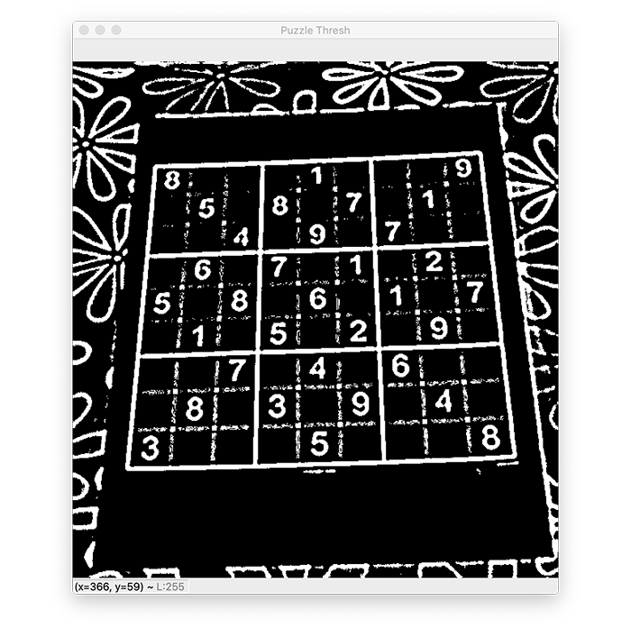
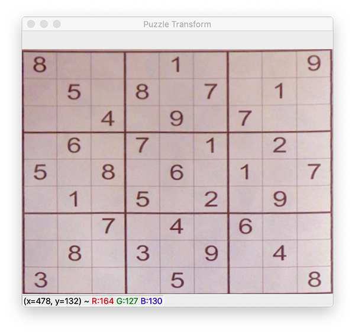
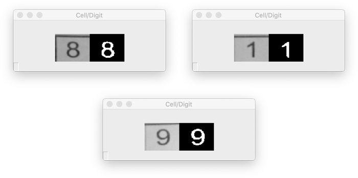

# Sudoku_AR

Sudoku Solver AR is an augmented reality Sudoku solver. It captures video using a camera, finds Sudoku puzzles in the photo, and then displays answers to those puzzles in such a way that they look like they are part of the original scene.

## Technology Used

 - Tensoflow
 - OpenCv
 - Python

## Workflow

# STEPS 
 1. Input the Sudoku image.
 

 2. Apply thresholding to image.
 

 3. Select the biggest contour with four corners and perform perspective transform.
 
 

 4. Divide the wrapped image into 81 cells, extract each cell in the warped image and chop it borders as it may contain some white pixels.  
 

 
 5. Predict the number on cell using Neural Network, trained on CIFAR dataset, generate sudoku board and solve with py-sudoku library.

## Usage

`python3 main.py` 

## Features

-  Automatically Detects Sudoku Block
-  Fast Prediction

## To-DO

- Detect Sudoku Block in live video stream and solve
- Detect multiple sudoku board in a frame
- Add rotation robustness

